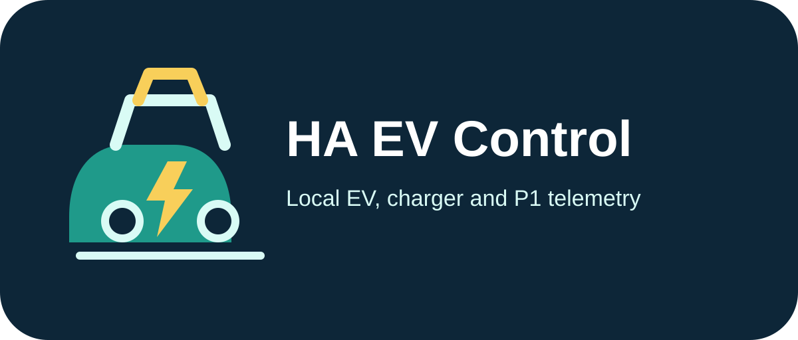

# HA EV Control



[![Release][release-badge]][release-url]
[![Validate][validate-badge]][validate-url]
[![CI][ci-badge]][ci-url]
[![License][license-badge]][license-url]
[![Home Assistant][ha-badge]][ha-url]
[![HACS Custom][hacs-badge]][hacs-url]

[release-badge]: https://img.shields.io/github/v/release/hunter-nl/HA-EVCTRL?include_prereleases&sort=semver&display_name=release&label=Release
[release-url]: https://github.com/hunter-nl/HA-EVCTRL/releases
[validate-badge]: https://img.shields.io/github/actions/workflow/status/hunter-nl/HA-EVCTRL/validate.yaml?label=Validate
[validate-url]: https://github.com/hunter-nl/HA-EVCTRL/actions/workflows/validate.yaml
[ci-badge]: https://img.shields.io/github/actions/workflow/status/hunter-nl/HA-EVCTRL/ci.yaml?label=CI
[ci-url]: https://github.com/hunter-nl/HA-EVCTRL/actions/workflows/ci.yaml
[license-badge]: https://img.shields.io/github/license/hunter-nl/HA-EVCTRL?color=blue
[license-url]: https://github.com/hunter-nl/HA-EVCTRL/blob/main/LICENSE
[ha-badge]: https://img.shields.io/badge/Home--Assistant-2026.7.0%2B-green?logo=homeassistant
[ha-url]: https://www.home-assistant.io/
[hacs-badge]: https://img.shields.io/badge/HACS-Custom-41BDF5?logo=homeassistantcommunitystore&logoColor=white
[hacs-url]: https://www.hacs.xyz/docs/faq/custom_repositories/

HA EV Control is a local Home Assistant integration for telemetry from an
ESP32-based EV controller. It turns P1 smart-meter, EV charger, EV energy
meter, and charging-session messages into Home Assistant entities without a
cloud service.

## What it does

- Connects to a WebSocket or Server-Sent Events (SSE) endpoint exposed by the
  controller.
- Creates grouped devices and sensors for P1, EV meter, EV controller, and EV
  charging-session telemetry.
- Supports energy, power, current, voltage, temperature, tariff, status, and
  selected binary states when the controller provides them.
- Reconnects automatically after a disconnected or inactive telemetry stream.
- Shows a Home Assistant notification if valid telemetry has been unavailable
  for five minutes, and dismisses it automatically after recovery.

## Requirements

- Home Assistant 2026.7.0 or newer.
- An ESP32-based controller reachable from Home Assistant that exposes a
  WebSocket (`ws://` or `wss://`) or SSE (`http://` or `https://`) endpoint.
- A JSON telemetry payload compatible with the fields listed below.

## Install

### HACS (recommended)

1. Open **HACS** → **⋮** → **Custom repositories**.
2. Add `hunter-nl/HA-EVCTRL` with category **Integration**.
3. Find **HA EV Control** and download it.
4. Restart Home Assistant.
5. Open **Settings** → **Devices & services** → **Add integration**, select
   **HA EV Control**, and enter the controller’s streaming URL.

### Manual

1. Copy `custom_components/ha_evctrl` to
   `/config/custom_components/ha_evctrl`.
2. Restart Home Assistant.
3. Add **HA EV Control** from **Settings** → **Devices & services**.

## Configure

| Setting | Description |
| --- | --- |
| Streaming URL | Required absolute controller endpoint. Use `ws://` or `wss://` for WebSocket, or `http://`/`https://` for SSE. |
| Reconnect interval | Time in seconds before a dropped stream is retried. Defaults to 15 seconds; supported range is 5–300 seconds. |
| Sensor prefix | Prefix used in entity and device names. Defaults to `EV Control`. |
| Payload log level | Optional diagnostic setting: `Off`, `Info`, or `Debug`. Avoid `Debug` unless troubleshooting because it logs complete payloads. |

The integration selects the transport from the URL scheme. SSE endpoints are
commonly named `/events`, but the exact path is determined by the controller.
The integration identifies itself to JunoBox controllers with the
`X-JunoBox-Client: home-assistant` request header.

### Session cost

**Session Cost** is calculated locally from the current session charge and the
average of these Home Assistant helpers:

- `input_number.electricity_export_t1_price`
- `input_number.electricity_export_t2_price`

The result is rounded up to two decimal places. Create both helpers with a
price per kWh in EUR before using the session-cost sensor.

## Entities and payloads

The integration creates entities for fields available in the latest JSON object.
Typical coverage includes:

- P1 delivered and returned energy by tariff, grid power, phase current and
  voltage, gas reading, and current tariff.
- EV meter total energy and power.
- EVSE charge current, temperature, state, mode, error, and selected utility
  states such as door or firmware-update availability.
- Charging-session energy, meter start/end, duration, and related session data.

Payload field names are handled case-insensitively and several controller
variants are accepted. A typical payload looks like:

```json
{
  "T1Plus": {"value": 1234.5, "unit": "kWh"},
  "PowerPlus": {"value": 0.8, "unit": "kW"},
  "EVSE": {
    "Charge": {"value": 16, "unit": "A"},
    "Temperature": {"value": 28.4, "unit": "°C"}
  },
  "DoorState": "DOOR OPEN"
}
```

Only JSON objects are accepted. Invalid messages are ignored; they do not
overwrite the last known sensor values.

## Upgrade

Before upgrading, create a Home Assistant backup and read the release notes.
For HACS, download the update and restart Home Assistant. For manual installs,
replace `/config/custom_components/ha_evctrl` with the version from the desired
release, then restart. Existing integration settings are retained.

## Troubleshooting

- Confirm the URL is reachable from the Home Assistant host and uses an
  accepted scheme: `http`, `https`, `ws`, or `wss`.
- Confirm that an SSE endpoint returns `text/event-stream`, or that the
  WebSocket sends complete JSON objects.
- Check that the controller is sending valid JSON objects; arrays and malformed
  JSON are ignored deliberately.
- If a P1 phase sensor is unknown, update to the latest integration version;
  it accepts the JunoBox `PowerDeliveredL*`, `PowerReturnedL*`, and
  `PowerL*Plus`/`PowerL*Min` field variants.
- A persistent notification indicates that no valid telemetry was received for
  five minutes. The integration continues reconnecting automatically.
- To investigate a problem, set **Payload log level** to `Debug` temporarily
  and enable debug logging for `custom_components.ha_evctrl`. Payloads can
  contain sensitive household telemetry, so turn it off afterward.

## Support

- [GitHub Issues](https://github.com/hunter-nl/HA-EVCTRL/issues)
- [Home Assistant Community](https://community.home-assistant.io/)

## Funding

If you find this project useful, consider supporting its development:

<a href="https://www.buymeacoffee.com/hunter.nl" target="_blank"></a>
